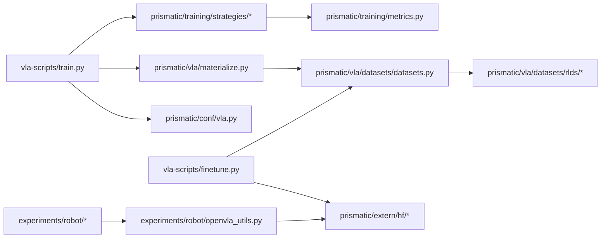

--由于我们使用的是镜像，workspace是处在/目录下（/workspace），因此大的模型和数据集只能存在硬盘/opt/data/private下面新建一个文件夹，写代码文件的时候一定要注意数据集和模型的下载和调用路径

--和我对话的回答要用中文回复

--由于我们的服务器无法连接huggingface，所以在新终端里需要export HF_ENDPOINT=https://hf-mirror.com用huggingface镜像

--由于我们的服务器是没有显示屏的（headless）因此，在后续evaluate的时候，需要虚拟显示器，具体指令如下：
apt-get install libegl-dev xvfb libgl1-mesa-dri libgl1-mesa-dev libgl1-mesa-glx libstdc++6
export LIBGL_DRIVERS_PATH=/usr/lib/x86_64-linux-gnu/dri/ 
ln -sf /usr/lib/x86_64-linux-gnu/libstdc++.so.6 ${CONDA_PREFIX}/lib/libstdc++.so.6
Xvfb :9 &
export DISPLAY=:9
export MUJOCO_GL=glx
然后执行要执行的文件 


--在进行github代码提交的过程中，如果发现不是你做的改动，而是用户自发做的代码改动，也是可以接受的。如果文件夹里有出现submodule，比如LIBERO这种外部仓库，那就不推他，只提交文件主代码


--如果训练出现报错，自动检查终端输出报错日志然后进行代码检查和修改，自动运行继续试验

--如果训练出现发现训练效果不好，比如训练loss收敛不再下降，则需要暂停训练，然后仔细分析原因，修改训练超参数，再进行训练，直到达到应该有的效果
---

# 第一部分：项目架构分析

## 1.1 项目目录树（L=3）

```text
/workspace/openvla
├── LICENSE
├── Makefile
├── README.md
├── requirements-min.txt
├── pyproject.toml
├── docs
├── experiments
│   └── robot
│       ├── bridge
│       └── libero
├── LIBERO
│   ├── benchmark_scripts
│   ├── images
│   ├── libero
│   ├── notebooks
│   ├── scripts
│   └── templates
├── prismatic
│   ├── conf
│   ├── extern
│   │   └── hf
│   ├── models
│   │   ├── backbones
│   │   ├── vlas
│   │   └── vlms
│   ├── overwatch
│   ├── preprocessing
│   │   └── datasets
│   ├── training
│   │   └── strategies
│   ├── util
│   └── vla
│       └── datasets
├── scripts
│   ├── additional-datasets
│   └── extern
└── vla-scripts
    └── extern
```

**Checklist**

* [ ] 我知道训练/微调/eval 的入口脚本分别在哪
* [ ] 我知道核心代码主要在 `prismatic/` 与 `vla-scripts/`

---

## 1.2 核心模块及职责（面向改代码的人）

### `prismatic/`（核心模型 + 数据 + 训练）

* 负责：模型封装、HF 适配、VLA 数据管线、训练策略（含 FSDP）、指标。
* 关键文件（非穷尽）：

  * 配置：`prismatic/conf/vla.py`
  * 模型封装：`prismatic/models/vlas/openvla.py`
  * HF processor/model：`prismatic/extern/hf/processing_prismatic.py`, `prismatic/extern/hf/modeling_prismatic.py`
  * VLA 数据：`prismatic/vla/materialize.py`, `prismatic/vla/datasets/datasets.py`, `prismatic/vla/datasets/rlds/**`
  * 训练策略：`prismatic/training/strategies/base_strategy.py`, `prismatic/training/strategies/fsdp.py`

### `vla-scripts/`（训练/微调 CLI 入口）

* 负责：定义训练/微调配置（draccus），组织数据与训练策略，启动训练。
* 关键文件：

  * LoRA 微调：`vla-scripts/finetune.py`
  * 训练（含 FSDP）：`vla-scripts/train.py`

### `research/`（研究管线新增：ICSM + HSW + Thermostat）

* 负责：探针集构建、离线 ICSM 子空间、训练时 HSW 梯度手术、Thermostat 闭环控制。
* 关键文件（新增）：

  * Probe 数据：`research/probe/probe_dataset.py`, `research/probe/hidden_and_mask.py`
  * 离线 ICSM：`research/icms/offline_icms.py`
  * HSW hook：`research/hooks/hsw_hook.py`
  * Thermostat：`research/thermostat/thermostat.py`

### `experiments/robot/`（评测入口 + 推理工具）

* 负责：在 Bridge V2 实机与 LIBERO 仿真环境跑评测；提供推理 utilities。
* 关键文件：

  * Bridge：`experiments/robot/bridge/run_bridgev2_eval.py`
  * LIBERO：`experiments/robot/libero/run_libero_eval.py`
  * 推理工具：`experiments/robot/openvla_utils.py`, `experiments/robot/robot_utils.py`

### `LIBERO/`

* 负责：LIBERO benchmark 本体代码与资源（供仿真评测调用）。
* \[需补充] 本文不展开 LIBERO 内部 API；如后续要改评测，需要再读 `LIBERO/libero/**`。

**Checklist**

* [ ] 我知道“训练/微调/评测”分别改哪里最合适
* [ ] 我知道“数据/模型/训练 loop”主要都在 `prismatic/`

---

## 1.3 两张关键 Mermaid 图（用于快速定位依赖与数据流）

### 模块依赖关系图（入口脚本 → 核心模块）



### 训练数据流图（RLDS → transform/collator → model → loss → step）

```mermaid
flowchart LR
    A[RLDS TFDS Dataset] --> B[RLDSBatchTransform]
    B --> C[PaddedCollatorForActionPrediction]
    C --> D[Processor outputs: input_ids/pixel_values/...]
    D --> E[Model forward]
    E --> F[Action prediction loss]
    F --> G[Optimizer step / (FSDP)]
```

**Checklist**

* [ ] 我知道 batch 字段从哪里来（transform/collator）
* [ ] 我知道训练 loop 主要在 `TrainingStrategy.run_vla_training`

---

## 1.4 关键接口速查表（后续实现方法会频繁引用）

### 推理接口（predict\_action）

* `OpenVLA.predict_action(self, image: Image, instruction: str, unnorm_key: Optional[str] = None, **kwargs) -> np.ndarray`
  来源：`prismatic/models/vlas/openvla.py`（见文件内 `predict_action` 定义区域）
* `OpenVLAForActionPrediction.predict_action(self, input_ids: Optional[torch.LongTensor] = None, unnorm_key: Optional[str] = None, **kwargs) -> np.ndarray`
  来源：`prismatic/extern/hf/modeling_prismatic.py`（见文件内 `predict_action` 定义区域）

### Processor（文本+图像 → BatchFeature）

* `PrismaticProcessor.__call__(self, text, images, padding=False, truncation=None, max_length=None, return_tensors=TensorType.PYTORCH) -> BatchFeature`
  来源：`prismatic/extern/hf/processing_prismatic.py`

### 数据集与 collator 构建

* `get_vla_dataset_and_collator(...) -> Tuple[Dataset, ActionTokenizer, PaddedCollatorForActionPrediction]`
  来源：`prismatic/vla/materialize.py`

### RLDS batch transform 的核心输出字段（训练时会用）

* `RLDSBatchTransform.__call__` 产出字段包含：`pixel_values`, `input_ids`, `labels`, `dataset_name`
  来源：`prismatic/vla/datasets/datasets.py`

### 训练 loop 真实读取的 batch 字段（必须与我们方法 hook 对齐）

* `input_ids`, `attention_mask`, `pixel_values`, `labels`, `dataset_names`
  来源：`prismatic/training/strategies/base_strategy.py`（`run_vla_training` 内部 batch 解包区域）

**Checklist**

* [ ] 我能在代码里快速找到 predict\_action / processor / dataloader / training loop 的位置
* [ ] 我知道方法实现时哪些张量是“事实来源”（batch字段、loss位置）

---

## 1.5 扩展点（最小侵入式改法，优先级从高到低）

### 数据侧扩展（最推荐：影响最大、侵入最小）

* 新增/修改 mixture：`OXE_NAMED_MIXTURES`
  文件：`prismatic/vla/datasets/rlds/oxe/mixtures.py`
* 新数据集接入：补 `OXE_DATASET_CONFIGS` + dataset transform
  文件：`prismatic/vla/datasets/rlds/oxe/configs.py`, `prismatic/vla/datasets/rlds/oxe/transforms.py`
* 动作离散化：`ActionTokenizer`（bin/range/encode/decode）
  文件：`prismatic/vla/action_tokenizer.py`

### 训练侧扩展（我们方法主要落点）

* 训练 loop 插入 hook / 指标 / 额外统计：
  文件：`prismatic/training/strategies/base_strategy.py`（`run_vla_training`）
* LoRA 微调扩展（本研究方法默认落点）：
  文件：`vla-scripts/finetune.py`

### 分布式与性能（先保持兼容，后续再深挖）

* FSDP wrapping / mixed precision / checkpoint：
  文件：`prismatic/training/strategies/fsdp.py`

### 推理 prompt 与裁剪策略（评测一致性常在这里出问题）

* prompt 模板 / center crop：
  文件：`experiments/robot/openvla_utils.py`

**Checklist**

* [ ] 我清楚“研究方法”应该尽量只动训练侧（最小侵入）
* [ ] 我清楚数据侧/推理侧修改会影响可比性，必须谨慎

---

# 第二部分：快速上手指南（最短路径）

> 研究方法完整跑法与产物说明见：`docs/RESEARCH_PIPELINE.md`

## 2.1 环境准备（最小依赖 vs 完整依赖）

* 最小推理依赖（示例）：`timm`, `tokenizers`, `torch`, `torchvision`, `transformers`
  参考：`requirements-min.txt`
* 训练/微调扩展依赖（示例）：`draccus`, `peft`, `tensorflow_datasets`, `dlimp` 等
  参考：`pyproject.toml`
* 版本基线（README 提到的一组版本）
  参考：`README.md`（当前文件里未标具体行号，因此标记）**\[需补充]**

**Checklist**

* [ ] 我能区分“只跑推理”与“要跑训练”需要装哪些依赖
* [ ] 我知道 flash-attn/transformers/torch 版本对可复现很关键

---

## 2.2 三条最短路径命令

### 2.2.1 仅推理（HF + Processor + predict\_action）

```bash
python - <<'PY'
from transformers import AutoModelForVision2Seq, AutoProcessor
from PIL import Image
import torch

processor = AutoProcessor.from_pretrained("openvla/openvla-7b", trust_remote_code=True)
vla = AutoModelForVision2Seq.from_pretrained(
    "openvla/openvla-7b",
    attn_implementation="flash_attention_2",
    torch_dtype=torch.bfloat16,
    low_cpu_mem_usage=True,
    trust_remote_code=True,
).to("cuda:0")

image = Image.new("RGB", (224, 224), color=(0, 0, 0))
prompt = "In: What action should the robot take to pick up the cup?\nOut:"
inputs = processor(prompt, image).to("cuda:0", dtype=torch.bfloat16)
action = vla.predict_action(**inputs, unnorm_key="bridge_orig", do_sample=False)
print(action)
PY
```

说明：

* `trust_remote_code=True`：openvla 的 HF 适配在 `prismatic/extern/hf/*`
* `attn_implementation="flash_attention_2"`：依赖 flash-attn
* `unnorm_key`：用于动作反归一化（与训练统计绑定）

**Checklist**

* [ ] 我能在一张 GPU 上跑通一次 predict\_action
* [ ] 我知道 prompt 模板会影响输出一致性（后续要统一）

---

### 2.2.2 LoRA 微调（finetune.py）

```bash
torchrun --standalone --nnodes 1 --nproc-per-node 1 vla-scripts/finetune.py \
  --vla_path openvla/openvla-7b \
  --data_root_dir <PATH/TO/RLDS/DATASETS/DIRECTORY> \
  --dataset_name bridge_orig \
  --run_root_dir <PATH/TO/LOGS/DIR> \
  --adapter_tmp_dir <PATH/TO/ADAPTER_TMP> \
  --lora_rank 32 \
  --batch_size 16 \
  --grad_accumulation_steps 1 \
  --learning_rate 5e-4 \
  --image_aug True \
  --save_steps 5000
```

说明：

* 该脚本入口：`vla-scripts/finetune.py`（`FinetuneConfig` + `finetune(cfg)`）
* 参数字段需与 `FinetuneConfig` 保持一致（后续研究方法会复用这套入口）

**Checklist**

* [ ] 我能用单卡跑通 finetune（哪怕只跑几步）
* [ ] 我能在日志目录找到 adapter/checkpoint 等产物

---

### 2.2.3 评测（LIBERO 仿真）

```bash
python experiments/robot/libero/run_libero_eval.py \
  --model_family openvla \
  --pretrained_checkpoint <CHECKPOINT_PATH> \
  --task_suite_name libero_spatial \
  --center_crop True \
  --run_id_note exp001 \
  --use_wandb False
```

说明：

* eval 入口：`experiments/robot/libero/run_libero_eval.py`
* 后续我们方法的 checkpoint/adapter 要么适配此入口，要么提供等价 wrapper（但必须能跑通）

**Checklist**

* [ ] 我能用某个 checkpoint 跑通一次 libero eval（哪怕很慢）
* [ ] 我能确保 eval 的预处理（crop/prompt）与训练对齐

---

# 第三部分：深入学习路线（给新成员/给未来的自己）

## 3.1 推荐阅读顺序（按“最短理解路径”组织）

1. `README.md`
2. `vla-scripts/finetune.py`（baseline 训练入口）
3. `vla-scripts/train.py`（更完整训练入口 + FSDP）
4. `prismatic/vla/materialize.py`（dataset/collator 构造）
5. `prismatic/vla/datasets/datasets.py`（RLDSBatchTransform / batch 字段）
6. `prismatic/training/strategies/base_strategy.py`（training loop 真正发生处）
7. `prismatic/extern/hf/processing_prismatic.py`（processor）
8. `prismatic/extern/hf/modeling_prismatic.py`（HF 模型 forward/predict\_action）
9. `prismatic/models/vlas/openvla.py`（OpenVLA 封装）
10. `experiments/robot/openvla_utils.py`（推理 prompt/crop）
11. `experiments/robot/libero/run_libero_eval.py`（仿真评测）
12. `prismatic/training/strategies/fsdp.py`（分布式细节）

**Checklist**

* [ ] 我能解释清楚 “数据怎么变成 batch，batch 怎么进模型，loss 在哪算”
* [ ] 我能定位“最小侵入式”插入研究方法的位置

---

## 3.2 核心概念速记（必须能对应到代码）

* RLDS：数据组织与标准化路径
  证据：`prismatic/vla/datasets/rlds/dataset.py`
* OXE mixture：多数据集混合采样权重机制
  证据：`prismatic/vla/datasets/rlds/oxe/mixtures.py`
* ActionTokenizer：动作离散化/反离散化
  证据：`prismatic/vla/action_tokenizer.py`
* PrismaticProcessor：多模态输入预处理（text+image→BatchFeature）
  证据：`prismatic/extern/hf/processing_prismatic.py`
* TrainingStrategy / run\_vla\_training：训练循环的真实落点（batch字段/loss/metrics）
  证据：`prismatic/training/strategies/base_strategy.py`
* FSDP 策略：分布式包裹、混精、checkpoint 相关
  证据：`prismatic/training/strategies/fsdp.py`

**Checklist**

* [ ] 我能把每个名词对应到一个具体文件
* [ ] 我知道“研究方法”要尽量复用这些已有概念，而不是发明新框架

---

## 3.3 二次开发示例（可复用的“改哪/怎么跑”模板）

### 示例 A：新增一个 RLDS 数据集并加入 mixture

1. 在 `prismatic/vla/datasets/rlds/oxe/configs.py` 添加 dataset 配置（obs keys/action encoding 等）
2. 在 `prismatic/vla/datasets/rlds/oxe/transforms.py` 添加对应 `*_dataset_transform`
3. 在 `prismatic/vla/datasets/rlds/oxe/mixtures.py` 注册到某个 mixture 或新增条目
4. 用 `vla-scripts/finetune.py` 指定 `--dataset_name`（或训练配置路径）运行

### 示例 B：在训练 loop 插入自定义指标或 hook

1. 在 `prismatic/training/strategies/base_strategy.py` 的 `run_vla_training` 中插入统计逻辑
2. 用 `prismatic/training/metrics.py` 提交并输出（JSONL / wandb）
3. 重跑 `vla-scripts/train.py` 或 `vla-scripts/finetune.py`

### 示例 C：新增一个 eval wrapper（复用现有推理工具）

1. 在 `experiments/robot/` 下新建脚本（例如 `experiments/robot/my_eval/run_my_eval.py`）
2. 复用 `experiments/robot/robot_utils.py` 与 `experiments/robot/openvla_utils.py` 的模型加载/取 action 工具
3. 保持参数风格与 `run_libero_eval.py` 一致，确保可替换比较

**Checklist**

* [ ] 我能在不破坏原 repo 的情况下新增功能（新增文件优先，少改核心）
* [ ] 我能保证 baseline 与 method 可直接对比（同 eval 入口/同预处理）

---

# 第四部分：我们要在 openvla 上实现的研究型微调方法（全局规范）

> 本节是后续所有编码任务的“总纲”。任何实现都必须服从这里的冻结约束与接口设计。

## 4.1 论文级研究问题（我们要证明什么）

我们研究：VLA 模型（OpenVLA-7B）在下游动作任务微调时的灾难性遗忘。

* 起点：已预训练好的 `openvla/openvla-7b`（具备视觉感知 + 指令理解 + 一定泛化能力）
* 下游：例如 LIBERO 等动作任务微调（action prediction loss）
* 风险：微调提升动作能力时破坏原来的通用能力（理解/推理/泛化）
* 方法：不引入 replay 训练数据；而是在反向传播阶段做**梯度子空间手术**，抑制“语义破坏方向”的梯度，同时保留足够可塑性学习动作。

最终需要的论文证据链：

1. 下游动作成功率不降（甚至提升）
2. 遗忘显著减轻（相对 baseline LoRA 微调）
3. 消融表明 ICSM/HSW/Thermostat 各自必要

**Checklist**

* [ ] 我能用一句话解释我们方法的核心：gradient surgery 而非 replay
* [ ] 我能说清楚 baseline 是什么、method 多了什么

---

## 4.2 冻结的技术路线（不能走偏）

* Codebase：openvla 官方开源 repo（PyTorch）
* Backbone checkpoint：`openvla/openvla-7b`（HF weights）
* 微调方式：LoRA（PEFT）
* 方法构件：ICSM（离线一次） + HSW（训练时hook） + Thermostat（训练时闭环） + 层分组共享子空间
* 明确不做：FAST/OFT 扩展；不做 flow-matching/action-expert；不靠 replay 数据训练来“替代”我们的机制

**Checklist**

* [ ] 我写的任何代码都不会强行改 openvla 的基本训练范式
* [ ] 我不会引入需要额外训练数据的 replay 机制来“假装解决遗忘”

---

## 4.3 方法 Pipeline（工程实现视角）

### 数据：两套数据（严格区分用途）

1. Downstream train set（用于参数更新）

* 来自 openvla 既有数据管线（RLDS 等）
* batch 字段按现有实现为准（见 `TrainingStrategy.run_vla_training`）

2. Probe set（只做统计/漂移监控，不用于更新参数）

* N≈500（可配置）
* 每条至少含 image + instruction text（动作可无）
* 用途：ICSM 子空间构建 + Thermostat 漂移度量

### 离线阶段：ICSM（Teacher-only，只做一次）

Teacher = 预训练 openvla-7b（冻结），在 probe 上：

1. 定义 instruction token mask（instr\_mask）
   **\[需补充]** 需从 openvla 的 prompt/template/tokenizer 机制确认“哪些 tokens 属于 instruction”
2. 对代表层 hidden states 做 mean pooling 得 `s_i ∈ R^D`
3. 对中心化矩阵 `X [N,D]` 做 SVD，取右奇异向量 `V[:, :r]` 得候选子空间（r 默认 128）
4. 敏感度矫正：对每个方向 u\_k 做小扰动注入（broadcast 到 instruction tokens 的 hidden），看输出分布变化（KL 等）得到脆弱度并重排
5. 分位划分：Fragile / Plastic / Null（三段）
6. 保存离线产物：每个代表层一套 `Uf, Up, mu, C_T` + meta.json

离线产物目录建议（冻结建议）：

* `artifacts/icms_openvla7b/<layer_id>/Uf.pt`
* `artifacts/icms_openvla7b/<layer_id>/Up.pt`
* `artifacts/icms_openvla7b/<layer_id>/mu.pt`
* `artifacts/icms_openvla7b/<layer_id>/C_T.pt`
* `artifacts/icms_openvla7b/meta.json`

### 训练阶段：LoRA + HSW + Thermostat（Student-only）

* Student 从 openvla-7b 初始化，注入 LoRA（建议仅后部层，可配置）
* loss：使用 openvla 原生 action prediction loss（不发明新 loss）
* HSW：在高风险层注册 backward hook，对梯度做投影分解与重组
  `g' = gn + beta*gp + gamma*gf` 且“范数只缩不放”
* Thermostat：每 K steps 抽 probe 子 batch，计算漂移 `d = ||C_S - C_T||_F`，动态调 beta/gamma（d 越大 → gamma 越小）

**Checklist**

* [ ] 我清楚 offline(Teacher-only) 与 online(Student-only) 的边界
* [ ] 我清楚 probe 不能用于参数更新
* [ ] 我清楚我们改的是 backward 的梯度，而不是 forward 的 loss 结构

---

## 4.4 工程实现计划与接口设计（第一阶段蓝图）

> 目标：最小侵入式地把方法塞进 openvla，保持 baseline 可跑、method 可控、日志可审计、产物可复现。

### 已确认的 openvla 代码入口（来自已读文件）

* 微调入口（LoRA baseline）：`vla-scripts/finetune.py` 的 `FinetuneConfig` + `finetune(cfg)`
* 全量训练入口（FSDP）：`vla-scripts/train.py` 的 `TrainConfig` + `train(cfg)`
* 评测入口：

  * Bridge：`experiments/robot/bridge/run_bridgev2_eval.py`
  * LIBERO：`experiments/robot/libero/run_libero_eval.py`
* 数据/processor/collator：

  * `prismatic/vla/datasets/datasets.py`
  * `prismatic/vla/materialize.py`
  * `prismatic/vla/datasets/rlds/**`
  * `prismatic/extern/hf/processing_prismatic.py`
* 推理/模型：

  * `prismatic/models/vlas/openvla.py`
  * `prismatic/extern/hf/modeling_prismatic.py`

### 未确认但必须补齐的关键点（会阻塞 ICSM/HSW）

* 模型 forward 是否支持 `output_hidden_states`，以及 hidden states 的返回位置与层索引对齐方式
  需要继续读：`prismatic/extern/hf/modeling_prismatic.py`（forward）与底层 VLM forward **\[需补充]**
* instruction token mask 的可靠定义方式（prompt builder/tokenizer）
  需要继续读：prompt 构造与 tokenizer 相关实现 **\[需补充]**

### 建议新增目录结构（最小侵入式）

* `research/`

  * `icms/`（离线子空间构建、敏感度矫正）
  * `hooks/`（HSW 梯度手术 + 投影工具）
  * `thermostat/`（闭环控制逻辑）
  * `probe/`（probe 采样与统计）
* `artifacts/icms_openvla7b/`（离线产物）
* `configs/`（baseline 与 method 配置）
* `scripts/`（复现实验的命令模板）
* `docs/RESEARCH_METHOD.md`（跑法与产物说明）

### 最小 API（冻结建议）

* `research/icms/offline_icms.py`

  * 输入：model、probe\_dataloader、layer\_ids、instr\_mask\_fn、r、epsilon
  * 输出：每层 `Uf, Up, mu, C_T` + meta.json
  * 依赖：hidden states 获取方式 **\[需补充]**
* `research/hooks/hsw_hook.py`

  * 输入：目标层 module、Uf/Up、beta/gamma
  * 行为：backward hook 投影重组，范数只缩不放
* `research/thermostat/thermostat.py`

  * 输入：probe\_dataloader、teacher\_stats、layer\_ids、update\_interval
  * 输出：beta/gamma 状态 + 漂移日志 d
* `trainer_integration`

  * 在 `vla-scripts/finetune.py` 最小化改动：初始化后注册 hook；训练 loop 内周期性调用 thermostat

### 验收标准（必须可审计）

* 离线产物正确落盘：路径存在、维度匹配 hidden size、meta.json 记录完整
* hook 生效且不破坏 baseline：开关对比（loss下降）、梯度分量日志可见（||g||, ||gf||, ||gp||, ||gn||, ||g'||）
* thermostat 闭环在跑：日志持续输出 d、beta、gamma；冷启动校准后再调节

**Checklist**

* [ ] 我知道第一阶段编码前必须先补齐 hidden\_states 与 instr\_mask 的证据
* [ ] 我知道所有新模块要可开关（baseline/method 对照）
* [ ] 我知道日志与产物是“论文可复现”的一部分，不是可选项

---

## 4.5 我们下一步编码的优先级建议（写给 agent 的行动指南）

优先级按“风险最小→最能验证 pipeline 正确”排序：

1. 先把 “hidden states 获取 + instruction mask 定义” 做成可复用工具（否则 ICSM/HSW 无从谈起）
2. 做离线 ICSM：probe forward → pooled → SVD → 敏感度矫正 → 落盘（先单层/小 r 测通）
3. 做 HSW hook：先在 1-2 层启用，验证梯度重组日志正确
4. 做 Thermostat：先只计算漂移 d 并写日志，不调 beta/gamma；确认稳定后再闭环
5. 集成进 finetune pipeline，保证 baseline 不回归（开关可控）
6. 最后跑最小可复现实验：baseline vs method（至少几百 step）+ libero eval smoke test

**Checklist**

* [ ] 我能把编码任务拆成小模块并逐个验证
* [ ] 我不会一上来改大训练框架导致不可调试

---

# 附录：当前已知的“潜在坑”（提前写死避免踩雷）

1. hidden\_states 获取路径不明确：必须先搞清 forward/return\_dict/output\_hidden\_states 机制，否则 ICSM/HSW 会写成“伪实现”。
2. instruction mask：不能拍脑袋用字符串长度/分隔符；必须从 tokenizer/prompt 实现中得到可复现的 token 区间。
3. eval 一致性：prompt 模板、center crop、unnorm\_key 一旦不一致，baseline 与 method 比较就会失真。
4. FSDP/多卡兼容：第一阶段不强制，但新代码要避免写死单卡假设（例如 `.to("cuda:0")` 出现在训练核心路径里）。

**Checklist**

* [ ] 我知道哪些问题“没证据就不能写”
* [ ] 我知道哪些一致性因素会毁掉对照实验

```

---

如果你希望我再做一步“更狠的压缩”，我可以把它进一步整理成两份文件：

- `docs/OVERVIEW.md`：只保留 openvla 代码结构与入口（更短、更像官方文档）
- `docs/RESEARCH_GLOBAL_CONTEXT.md`：只保留我们研究 pipeline + 接口 + 验收标准（更像 spec）

但按你说“要设为全局上下文”，我觉得现在这种 **“一份文档两条主线、但强分区”** 最适合 agent 持续记忆。
::contentReference[oaicite:0]{index=0}
```
